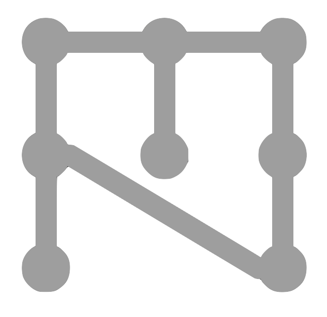

Install instructions for developers
######################################################

In order to develop for ezmsg, you need to set up a development environment. This involves installing the necessary dependencies and tools. Additionally, the `GitHub repository of ezmsg <https://github.com/ezmsg-org/ezmsg/>`_ is protected; you will need to fork the repository and set up ssh keys to access it. Any work can then be done in your forked repository, and the submitted via a `Pull Request <https://docs.github.com/en/pull-requests/collaborating-with-pull-requests/proposing-changes-to-your-work-with-pull-requests/creating-a-pull-request-from-a-fork>`_ to the ``dev`` branch of the main repository.

.. note:: It is recommended to use `uv <https://docs.astral.sh/uv/getting-started/installation/>`_ to manage the development environment. There are alternatives to this including `poetry`, but `uv` is the method used by the ezmsg development team and explained below. 

|ezmsg_logo_small| Prerequisites
=================================

1. `Install uv <https://docs.astral.sh/uv/getting-started/installation/>`_
2. `Set up ssh keys to access GitHub <https://docs.github.com/en/authentication/connecting-to-github-with-ssh>`_

Please ensure that your GitHub account is identifiable to you - either the username or email address associated with your account should include your first and last names. 

|ezmsg_logo_small| Setup
==========================

1. `Fork <https://docs.github.com/en/pull-requests/collaborating-with-pull-requests/working-with-forks/fork-a-repo>`_ the ezmsg repository.
2. `Clone <https://docs.github.com/en/repositories/creating-and-managing-repositories/cloning-a-repository>`_ your forked repository to your local machine using ssh.
3. Change directory to your local ezmsg clone (``$ cd path/to/your/ezmsg``)
4. Run ``$ uv sync --all-groups`` to install all dependencies.

We have tried to keep external dependencies to a minimum. However, for development purposes, we do have some additional dependencies for testing and documentation generation. The ``--all-extras`` flag ensures these are also installed. We have not included any pre-commit hooks by default, but expect all code to conform to the style guidelines outlined in the `developer standard documentation <standard>`_. `uv` has both a linter and formatter built-in, so you can use these to ensure your code meets the style guidelines.

.. note:: the ``uv sync`` command will create a virtual environment in the `.venv` folder in the root of the ezmsg repository. It will then install the dependencies specified in the `pyproject.toml` file into this virtual environment. 

