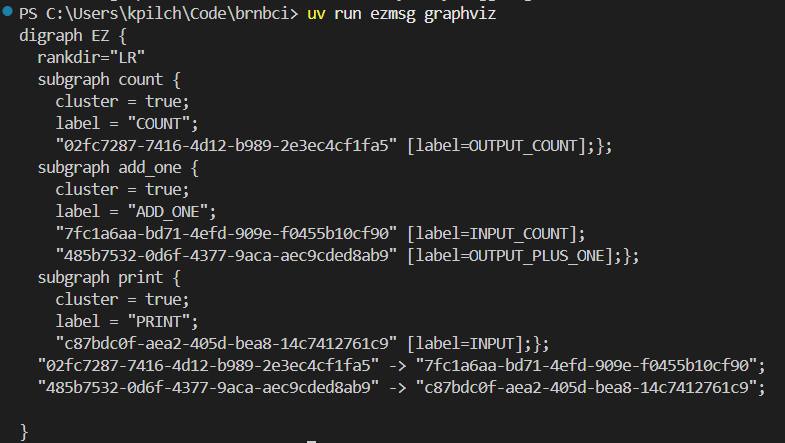
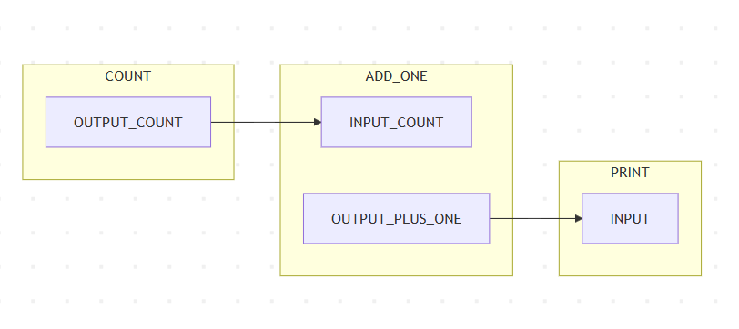

How to visualise the ezmsg pipeline graph?
##############################################

Other than the ``serve``, ``start`` and ``shutdown`` commands, the ezmsg command-line interface allows you to visualise your pipeline graphically. The two available commands are ``graphviz`` and ``mermaid``, corresponding to the two visualisation formats we support.

While the pipeline is running, if you run the following in a new terminal window:

.. code-block:: bash

   ezmsg graphviz --address 127.0.0.1:25978

then ezmsg will output a **Graphviz** representation of the pipeline to the terminal. As an example, here is the representation of the simple pipeline from the :doc:`tutorial <../../tutorials/run>`:

.. note:: You can copy this output and paste it into a Graphviz live editor, such as `<https://dreampuf.github.io/GraphvizOnline/>`_, to view the pipeline graphically.

.. note:: The really long numerical node identifiers are simply randomly generated unique identifiers for each connection point (since the names may be the same like `INPUT_SIGNAL`). These identifiers have no special meaning.

.. warning:: This command and the ones described in the :ref:`mermaid-section` section below will only output the pipeline graph if the ezmsg system is running and has a pipeline connected to it. If you run this command when the pipeline is finished or not running, you will not get any output. Our example is so simple that it will finish very quickly, so in order to visualise the graph maybe change the `iterations` in the `CountSettings` to a larger number, e.g. 100000, so that you have time to run the command and see the output.

.. _mermaid-section:

Mermaid visualisation
===========================

To visualise your pipeline using **Mermaid**, you can use the following command:

.. code-block:: bash

   ezmsg mermaid --address 127.0.0.1:25978

This will do two things:

- generate a Mermaid diagram format text of your pipeline and display it in the terminal
- open a mermaid live editor in your browser with the diagram pre-loaded.

.. note:: If you would like to disable the automatic opening of the Mermaid live editor, you can use the ``--nobrowser`` (or ``-n``) flag and append it to the call to ``ezmsg mermaid``. Then, if you would like to view the diagram, you can still copy and paste the diagram code from your terminal into a `Mermaid live editor <https://mermaid.live/>`_.

Notice that the diagram shows all the Components and connections in the pipeline, as well as the streams that are being used. If you don't care about the streams themselves, and are interested more in the Components and their connections, you can append the ``--compact`` (or ``-c``) option to simplify the visualisation: 

.. image:: ../../_static/_images/tutorial_graph_compact.png
   :width: 100%
   :alt: Compact Mermaid pipeline visualisation

.. |ezmsg_logo_small| image:: ../../_static/_images/ezmsg_logo.png
  :width: 40
  :alt: ezmsg logo
