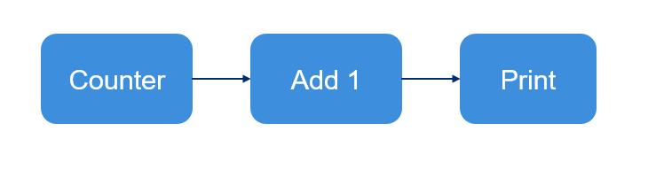
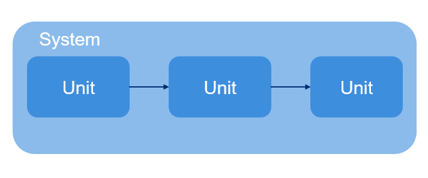

Your First ezmsg Pipeline
##############################

If this is your first time using ezmsg, you're in the right place. This notebook will walk you through the basics of creating a very simple ezmsg system. You can copy the code into your own Python script or Jupyter notebook environment using the helpful copy button in the top right corner of each code block.

ezmsg is ideal for creating modular processing pipelines whose steps can be arranged as a directed acyclic graph. In this notebook, we will walk through a very simple graph which generates a count of numbers, adds 1 to each number, and prints to standard output.

|tutorial_pipeline|

In ezmsg syntax, this graph would look like this:

|tutorial_system|

We will write an ezmsg Unit for each discrete step of our pipeline, and then later show you how to optionally connect them together in a Collection. 

First, ensure you have ezmsg installed. Please consult :doc:`start` for installation instructions. 

.. note:: If you are using a Jupyter notebook, you can install ezmsg directly from the notebook using the following command:

   .. code-block:: bash

      !pip install ezmsg

Next, ensure we have all the necessary imports:

.. code-block:: python

    import ezmsg.core as ez
    from dataclasses import dataclass
    from collections.abc import AsyncGenerator

|ezmsg_logo_small| Building a basic ezmsg Unit
***********************************************

A very simple ezmsg Unit will be made up of the following components:

- settings provided in the form of a settings class (optional, at most one)
- state provided in the form of a state class (optional, at most one)
- input / output streams (required, at least one input or output)
- method that does the processing you desire for the Unit (required, at least one method) 

As one can see from above there is a lot of flexibility in which components are used and in what quantity. In particular, one can have multiple streams and processing methods (but not settings or state) adding more functionality to each Unit. 

Our very basic counting Unit will simply produce integers starting at 0. We don't need to worry about its state but we would like to specify at what point it stops so we'll create a settings class that contains how many numbers to generate. 

.. code-block:: python
    
    class CountSettings(ez.Settings):
        iterations: int

.. note:: We inherited from ``ez.Settings`` which is a frozen dataclass. This means that the settings are immutable after they are set, which is good practice for configuration data.

Next, we need to create a message type that the Unit will produce. This message will be sent to the next Unit in the pipeline. In this case, we will create a simple dataclass that contains an integer value. (In such a simple case, we could simply avoid creating a new class and use a simple integer, but this is a good practice for more complex messages.)

.. code-block:: python
    
    @dataclass
    class CountMessage:
        value: int

Now that we have the ingredients, we will create the Unit that will generate the count. Every Unit represents a node in the directed acyclic graph and should contain inputs and/or outputs and at least one function which subscribes to the inputs or publishes to the outputs.

For Count, we create an OutputStream and a publishing function which will perform the number calculation and yield CountMessages to the OutputStream.

.. code-block:: python
    
    class Count(ez.Unit):
        # Settings must be provided in this way: `SETTINGS = YourSettingsClass`
        # Do not instantiate the settings class here
        SETTINGS = CountSettings

        OUTPUT_COUNT = ez.OutputStream(CountMessage)

        @ez.publisher(OUTPUT_COUNT)
        async def count(self) -> AsyncGenerator:
            count = 0
            while count < self.SETTINGS.iterations:
                yield self.OUTPUT_COUNT, CountMessage(value=count)
                count = count + 1
            
            raise ez.NormalTermination

First, notice that we inherit from ``ez.Unit``, which is the base class for all ezmsg Units.

Next, notice that we provide the settings class as a class attribute called ``SETTINGS``. This is how ezmsg knows what settings type to use when instantiating the Unit. Instantiation is done at the system level as we will see in the section :ref:`creating-pipeline`.

.. note:: The ``SETTINGS = CountSettings`` format is important. It should always be in the format ``SETTINGS = YourSettingsClass`` with the only change being to replace `YourSettingsClass` with the name of the class.

Then, we define an output stream called ``OUTPUT_COUNT`` which will send messages of type ``CountMessage``. ``OUTPUT_COUNT`` is the name you provide to the outgoing stream, and ``CountMessage`` is the type of messages that will be sent on this stream. As an output stream, it will be used to connect the Unit to other Units in a System.

.. note:: ``CountMessage`` literally contains an integer, so in this very simple case we could have simply used ``OUTPUT_COUNT = ez.OutputStream(int)``. But this is good practice for more complex messages.

The method ``count()`` is where the actual number generation occurs. From the code, we can see that it generates integer values starting at 0 for the variable ``count`` and stops once it reaches the value of ``iterations`` within the Unit's ``SETTINGS`` attribute. 

It yields the tuple ``(self.OUTPUT_COUNT, CountMessage(value=count))``, which gives the output stream ``OUTPUT_COUNT`` a ``CountMessage`` with the value of ``count``. But in order for it to actually publish this value to other units we decorate the method with ``@ez.publisher(OUTPUT_COUNT)``. Finally, when the Unit completes its task, we raise ``ez.NormalTermination``, which indicates to ezmsg that this Unit is done processing.

.. note:: Important final note on the ``count()`` method. It is preceded by the ``async`` keyword. This indicates that the method is a coroutine function, and can be run asynchronously. This means that if it isn't ready to yield a value it relinquishes the control to another process. The benefit is that it does not block other processes from executing allowing more parallelised execution. This is a key feature of ezmsg and recommended when working with I/O bound tasks or long-running computations.

.. todo:: Provide picture on asynchronous execution and how it works in ezmsg.

|ezmsg_logo_small| Building a Unit with multiple streams
***********************************************************

The next Unit in the chain should accept a CountMessage from the first Unit, add 1 to its value, and yield a new CountMessage. To do this, we create a new Unit which contains a function which both subscribes and publishes. Analogously to when we decorated the ``count()`` method with ``@ez.publisher(OUTPUT_COUNT)``, we will decorate this function with both ``@ez.subscriber(<name-of-input-stream>)`` to indicate that it will receive messages from the input stream, and ``@ez.publisher(<name-of-output-stream>)`` to indicate that it will send messages to the output stream.

.. code-block:: python
    
    class AddOne(ez.Unit):

        INPUT_COUNT = ez.InputStream(CountMessage)
        OUTPUT_PLUS_ONE = ez.OutputStream(CountMessage)

        @ez.subscriber(INPUT_COUNT)
        @ez.publisher(OUTPUT_PLUS_ONE)
        async def on_message(self, message) -> AsyncGenerator:
            yield self.OUTPUT_PLUS_ONE, CountMessage(value=message.value + 1)

The subscribing function will be called anytime the Unit receives a message to the InputStream ``INPUT_COUNT`` that the function subscribes to. It will then publish the result of adding one to the OutputStream ``OUTPUT_PLUS_ONE``. 

We will connect this Unit to Count later on, when we create the full pipeline.

|ezmsg_logo_small| Another Unit - print the result
***************************************************

Finally, the last unit should print the value of any messages it receives. It will only have an input stream and no output stream, as it will not send any messages to other Units.

.. code-block:: python
    
    class PrintValue(ez.Unit):

        INPUT = ez.InputStream(CountMessage)

        @ez.subscriber(INPUT)
        async def on_message(self, message) -> None:
            print(message.value)

|ezmsg_logo_small| Combining multiple Units into a Collection
**************************************************************
We can optionally combine Units into a single node called a Collection. 

First, define the member Units. Then use ``configure()`` to apply settings to the component Units at initialisation. Finally use ``network()`` to provide an iterable of pairs that define how the Units are connected. Remember, connections are directed (one-way), so the pairs are in the form ``(from-Unit, to-Unit)``. As an example, in the first connection pair provided below, the first element is the output stream of ``COUNT``, and the second element is the input stream of ``ADD_ONE``.

.. code-block:: python
    
    class CountCollection(ez.Collection):

        # Define member units
        COUNT = Count()
        ADD_ONE = AddOne()
        PRINT = PrintValue()

        # Use the configure function to apply settings to member Units
        def configure(self) -> None:
            self.COUNT.apply_settings(CountSettings(iterations=20))

        # Use the network function to connect inputs and outputs of Units
        def network(self) -> ez.NetworkDefinition:
            return (
                (self.COUNT.OUTPUT_COUNT, self.ADD_ONE.INPUT_COUNT),
                (self.ADD_ONE.OUTPUT_PLUS_ONE, self.PRINT.INPUT)
            )

.. note:: Within the ``configure()`` method, we applied settings to the ``Count`` Unit by using an in-built method called ``apply_settings()``. This method takes an instance of the settings class and applies it to the Unit. In this case, we set the number of iterations to 20, meaning that the Count Unit will generate numbers from 0 to 19.

.. note:: The ``configure()`` method is optional. If you do not need to apply settings to the member Units, you can omit it. The ``network()`` method is also optional, but it is required if you want to connect the Units together in a specific way. If you do not provide a ``network()`` method, the Units will not be connected and will not communicate with each other.

.. _creating-pipeline:

|ezmsg_logo_small| Creating a pipeline
***************************************

We combined the Units above into a Collection, but this doesn't always make sense, so let's step back and see how to create a pipeline using just the Units we created above. Notice, that setting up the connections is very similar to how we defined ``network()`` in the Collection above. 

.. code-block:: python
    
    components = {
        "COUNT": Count(settings=CountSettings(iterations=10)),
        "ADD_ONE": AddOne(),
        "PRINT": PrintValue()
    }
    connections = (
        (components["COUNT"].OUTPUT_COUNT, components["ADD_ONE"].INPUT_COUNT),
        (components["ADD_ONE"].OUTPUT_PLUS_ONE, components["PRINT"].INPUT)
    )
    ez.run(components = components, connections = connections)

.. note:: We instantiated the ``Count`` Unit with settings directly in the components dictionary. Another way is to use ``apply_settings()``:

    .. code-block:: python

        "COUNT": Count().apply_settings(iterations=10)

.. note:: The ``ez.run()`` function is the entry point to running an ezmsg system. It takes a dictionary of components (Units or Collections) and an iterable of connections (pairs of input/output streams) and runs the system. More on this in the next :doc:`tutorial section <run>`.

Quick Aside - Using the Collection to Create a Pipeline
=========================================================

If using a Collection, the above code is no different. Units and Collections are both seen by ezmsg as an object called a Component, so we could have simply done:

.. code-block:: python
    
    components = {"COUNT_COLLECTION": CountCollection()}
    connections = ()
    ez.run(components = components, connections = connections)

.. warning:: DO NOT have two different ``ez.run()`` calls in the same script or notebook. Only one ``ez.run()`` call is allowed per execution context. We have given you two examples of how to build a pipeline from Units, so when running the code, comment out one of the previous two code blocks (components, connections, and ``ez.run()`` calls). 

|ezmsg_logo_small| How to run the pipeline?
*********************************************

All the code is there now! If you want to run the pipeline, we just need to run the script. If you're using a Jupyter notebook, you can run the code cells directly. If you're using a Python script, save the code in a file (e.g., `pipeline.py`) and run it from the command line:

.. code-block:: bash

   python3 pipeline.py

There is more to running the pipeline than this little tutorial has shown you so far, so click Next below to check out the next section on :doc:`running ezmsg <run>` for more details on how to run your ezmsg pipelines and systems.

.. |ezmsg_logo_small| image:: ../_static/_images/ezmsg_logo.png
  :width: 40
  :alt: ezmsg logo
