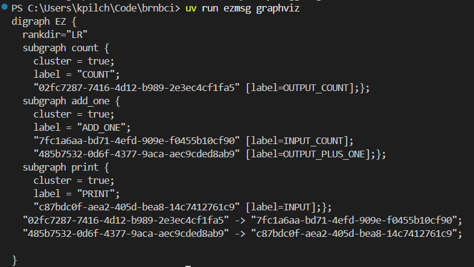
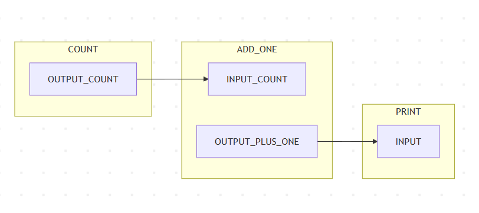
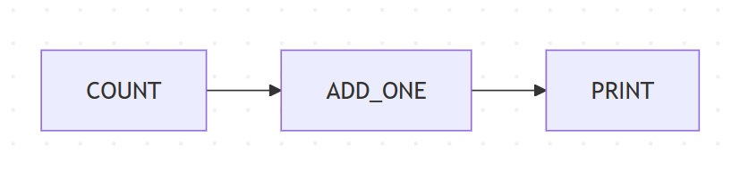

Running An ezmsg System
############################

In the previous :doc:`tutorial <pipeline>`, we finished by running a simple ezmsg pipeline directly through the use of the ``run()`` function within a python script. In this tutorial, we will explore how to run an ezmsg system in different ways, including using the command line interface and visualising the pipeline.

What actually happens when you run a script with an ezmsg pipeline and a ``run()`` function is that ezmsg starts a backend server called a **`GraphServer`**. This `GraphServer` manages the operation of any ezmsg pipeline connected to it. The naming comes from the fact that ezmsg pipelines are simply nodes - Units or Collections - connected in a :term:`directed acyclic graph` (:term:`DAG`\ ). 

The `GraphServer` is coupled with a **`SharedMemoryServer`** that allows for efficient data transfer between the different components of the pipeline. This is particularly useful for high-throughput applications where low latency is crucial. It utilises the in-built Python ``multiprocessing.shared_memory`` library to handle the data transfer between processes.

The reverse is true too: you can run ezmsg instance (start a `GraphServer`) without a pipeline, but until you attach an ezmsg pipeline nothing interesting will happen.

.. note:: For this tutorial, you will need to have :doc:`ezmsg installed <start>` and have an :doc:`ezmsg pipeline <pipeline>` ready to run.

For the sake of this tutorial, we recreate the script from the :doc:`pipeline` tutorial here. Copy it into a file called `tutorial_pipeline.py` in the root of the ezmsg repository.

.. code-block:: python

   # tutorial_pipeline.py
   import ezmsg.core as ez
   from dataclasses import dataclass
   from collections.abc import AsyncGenerator

   class CountSettings(ez.Settings):
       iterations: int

   @dataclass
   class CountMessage:
       value: int

   class Count(ez.Unit):
       SETTINGS = CountSettings

       OUTPUT_COUNT = ez.OutputStream(CountMessage)

       @ez.publisher(OUTPUT_COUNT)
       async def count(self) -> AsyncGenerator:
           count = 0
           while count < self.SETTINGS.iterations:
               yield self.OUTPUT_COUNT, CountMessage(value=count)
               count = count + 1

           raise ez.NormalTermination

   class AddOne(ez.Unit):
       INPUT_COUNT = ez.InputStream(CountMessage)
       OUTPUT_PLUS_ONE = ez.OutputStream(CountMessage)

       @ez.subscriber(INPUT_COUNT)
       @ez.publisher(OUTPUT_PLUS_ONE)
       async def on_message(self, message) -> AsyncGenerator:
           yield self.OUTPUT_PLUS_ONE, CountMessage(value=message.value + 1)

   class PrintValue(ez.Unit):
       INPUT = ez.InputStream(CountMessage)

       @ez.subscriber(INPUT)
       async def on_message(self, message) -> None:
           print(message.value)

   components = {
       "COUNT": Count(settings=CountSettings(iterations=10)),
       "ADD_ONE": AddOne(),
       "PRINT": PrintValue()
   }
   connections = (
       (components["COUNT"].OUTPUT_COUNT, components["ADD_ONE"].INPUT_COUNT),
       (components["ADD_ONE"].OUTPUT_PLUS_ONE, components["PRINT"].INPUT)
   )
   ez.run(components=components, connections=connections)

|ezmsg_logo_small| Run the ezmsg pipeline from your script
***********************************************************

To run the pipeline, you can use the following command in the :term:`terminal`:

.. code-block:: bash

   python3 tutorial_pipeline.py

This will start the pipeline and begin processing data. 

.. important:: You can also run this ezmsg pipeline in a **Jupyter notebook** environment with a slight tweak. Simply copy the above into a code cell (or cells). But when using ``run()``, include the optional kwarg ``force_single_process=True``:

   .. code-block:: python

      ez.run(components=components, connections=connections, force_single_process=True)

.. tip:: As mentioned before when running a script like this, `ezmsg` sets up a local `GraphServer` to manage the pipeline execution. It will automatically choose appropriate settings for the `GraphServer`, including the address (host and port). We often call this running ezmsg in "*sandbox mode*", because in order to connect to it you would need to guess the address set by ezmsg.

The alternative, if you want the graphserver to use a particular address, is to either:

1. set the ``EZMSG_GRAPH_SERVER`` environment variable before running your script.
2. start an ezmsg instance from the command line with the `serve` or `start` commands, which will allow you to specify the address and port.

.. note:: For a deeper dive into the backend of ezmsg, please refer to the :doc:`../explanations/ezmsg-design` section. Here you will find more information about the ezmsg graphserver, how it works, and how to configure it.

|ezmsg_logo_small| Run the pipeline using the command line
************************************************************

The ``ezmsg`` command line interface exposes extra tools to manage a pipeline that is running in the background on a machine. Run ``ezmsg -h`` to see all the available options. Currently, there are five commands available: ``start``, ``serve``, ``shutdown``, ``mermaid``, and ``graphviz``. The first three are used to manage the ezmsg system, while the last two are used for visualising the pipeline.

.. tip:: If you're working with the ezmsg repository, and you have a virtual environment set up through `uv`, you can ensure you're running with expected dependency versions by using `uv run` before all of the terminal commands in this section. For example:

   .. code-block:: bash

      # first terminal window
      uv run ezmsg serve --address 127.0.0.1:25978
      
      # second terminal window
      uv run python3 tutorial_pipeline.py

Step 1. Start the ezmsg system
=================================

Paste and run the following in your terminal:

.. code-block:: bash

   ezmsg serve --address 127.0.0.1:25978

This command will start the ezmsg system and listen for incoming connections on host `127.0.0.1` at port `25978`. You can change the address and port as needed - the values here are actually the default that `ezmsg` will use if you leave out the ``--address`` option.

.. note:: You will notice that with the command ``serve``, ezmsg takes over your terminal in the sense that it runs ezmsg in the foreground, not allowing you to use this terminal for other purposes. In order to continue using the terminal, you will need to open a new terminal (you can have multiple terminals open). If instead you use the command ``start``, ezmsg will be forked to another process allowing you to use the current terminal. This is useful for running ezmsg in the background or as a service:

   .. code-block:: bash

      ezmsg start --address 127.0.0.1:25978

Step 2. Run the pipeline in ezmsg
==================================

Now that an ezmsg instance is running one can connect and run a pipeline to it. 
You will need to change the way you call ``ez.run()`` by adding an address to the call. 

In your script `tutorial_pipeline.py`, change the last line to:

.. code-block:: python

   ez.run(components=components, connections=connections, address="127.0.0.1:25978")

Now you can run your pipeline script from a **new** terminal window.

.. code-block:: bash    

   python3 tutorial_pipeline.py

Step 3. Shutdown ezmsg instance
=================================

When you are done with ezmsg, you can shutdown the ezmsg system by running the following command in a new terminal window:

.. code-block:: bash

   ezmsg shutdown --address 127.0.0.1:25978

This will gracefully shutdown the ezmsg system and release any resources it was using. Make sure to use the same address you used to start and run the ezmsg system. 

.. note:: If you used the ``serve`` command to start the ezmsg system, after running the ``shutdown`` command, you will see that the terminal where you started the ezmsg system will return to the command prompt. 

|ezmsg_logo_small| Visualising the ezmsg pipeline
*******************************************************

Other than the ``serve``, ``start`` and ``shutdown`` commands, the ezmsg command-line interface allows you to visualise your pipeline graphically. The two available commands are ``graphviz`` and ``mermaid``, corresponding to the two visualisation formats we support.

While the pipeline is running, if you run the following in a new terminal window:

.. code-block:: bash

   ezmsg graphviz --address 127.0.0.1:25978

then ezmsg will output a **Graphviz** representation of the pipeline to the terminal. 

.. note:: You can copy this output and paste it into a Graphviz live editor, such as `<https://dreampuf.github.io/GraphvizOnline/>`_, to view the pipeline graphically.

.. note:: The really long numerical node identifiers are simply randomly generated unique identifiers for each connection point (since the names may be the same like `INPUT_SIGNAL`). These identifiers have no special meaning.

.. warning:: This command and the ones described in the :ref:`mermaid-section-tutorial` section below will only output the pipeline graph if the ezmsg system is running and has a pipeline connected to it. If you run this command when the pipeline is finished or not running, you will not get any output. Our example is so simple that it will finish very quickly, so in order to visualise the graph maybe change the `iterations` in the `CountSettings` to a larger number, e.g. 100000, so that you have time to run the command and see the output.

.. _mermaid-section-tutorial:

Mermaid visualisation
===========================

To visualise your pipeline using **Mermaid**, you can use the following command:

.. code-block:: bash

   ezmsg mermaid --address 127.0.0.1:25978

This will do two things:

- generate a Mermaid diagram format text of your pipeline and display it in the terminal
- open a mermaid live editor in your browser with the diagram pre-loaded.

.. note:: If you would like to disable the automatic opening of the Mermaid live editor, you can use the ``--nobrowser`` (or ``-n``) flag and append it to the call to ``ezmsg mermaid``. Then, if you would like to view the diagram, you can still copy and paste the diagram code from your terminal into a `Mermaid live editor <https://mermaid.live/>`_.

Notice that the diagram shows all the Components and connections in the pipeline, as well as the streams that are being used. If you don't care about the streams themselves, and are interested more in the Components and their connections, you can append the ``--compact`` (or ``-c``) option to simplify the visualisation: 

|ezmsg_logo_small| Signal processing in ezmsg?
************************************************

Now that we have a basic ezmsg pipeline and can run it, it is time to learn about the full capabilities of ezmsg. In particular, we will explore how to use ezmsg for signal processing and make use of the specialized message format called :term:`AxisArray`.

.. |ezmsg_logo_small| image:: ../_static/_images/ezmsg_logo.png
  :width: 40
  :alt: ezmsg logo
