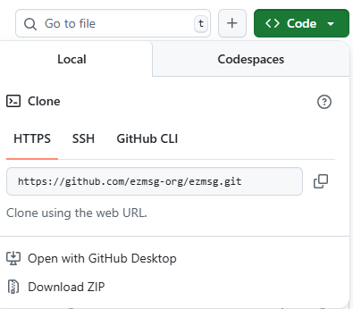

Installation and Configuration
###############################

This page contains information about installing ezmsg and its extensions. It also provides instructions for developers who want to contribute to the ezmsg project.

|ezmsg_logo_small| System Requirements
***************************************

ezmsg is written in and for **Python**, so it requires a Python interpreter to run. Currently, ezmsg requires at minimum Python 3.10. Beyond that, ezmsg is a pure Python library with no external dependencies.

This also means that ezmsg is cross-platform and should run on any operating system that supports Python, including Windows, macOS, and Linux.

In Windows and macOS, Python can be downloaded from the official website: `python.org <https://www.python.org/downloads/>`_. For newer users, we recommend using the `Anaconda <https://www.anaconda.com/download>`_ distribution of Python, which comes with a package manager and many useful libraries pre-installed.

On Linux, Python is usually pre-installed, but you can also install it using your package manager in your :term:`terminal`: 

.. code-block:: bash

   # For Debian/Ubuntu-based systems
   sudo apt install python3.<version> python3-pip -y

   # For Red Hat/CentOS-based systems
   sudo dnf install python3.<version> python3-pip -y

   # For Arch Linux-based systems
   sudo pacman -S python3.<version> python-pipx

where ``3.<version>`` is the version of Python you want to install (e.g. 3.12).

Whichever you choose, ensure that you have Python 3.8 or later installed on your system. You can verify your Python version by running in your terminal:

.. code-block:: bash

   python3 --version

|ezmsg_logo_small| Installing ezmsg
************************************

We can install ezmsg using :term:`pip`, which is the package manager for Python. It will handle all dependencies and ensure that you have the latest version. It will download the package from the Python Package Index (:term:`PyPI`) and install it on your system.

You can alternatively run ezmsg from source by cloning the repository, but this is only recommended for those planning to do some ezmsg development or if you have specific customization needs.

Regardless of the method you choose, you will need to use the :term:`terminal`.

From PyPI (using pip)
======================

To install the ezmsg framework, you can use pip in your terminal:

.. code-block:: bash

   pip install ezmsg

Once installed, you can start using ezmsg in your projects. You can skip straight to the section on :ref:`updating-ezmsg-tutorial`.

From source (using git)
==========================

You can also install ezmsg from the source (GitHub respository). This requires a lot more steps, but it is useful if you want to contribute to the project or if you want to run the latest development version of ezmsg.

.. important:: If you plan to make changes to the code or contribute to the project, please see the :doc:`Developer Guide <../developer/content-developer>` for more information on how to develop with ezmsg.

Step 1. Clone the project from GitHub
^^^^^^^^^^^^^^^^^^^^^^^^^^^^^^^^^^^^^^

.. note:: This step assumes you have a GitHub account. We generally recommend having a username or email associated with your account that can be tied to you. If you plan on developing for ezmsg, this, along with SSH keys and 2FA will be strictly necessary. 

This is done by visiting the `ezmsg repository <https://github.com/ezmsg-org/ezmsg#>`_. There is a green button called "Code" (see the above image) which, when clicked, will show you the URL to clone the repository. If you simply plan to build from source, you can choose the HTTPS URL. 

If you plan on contributing to the project, follow the instructions in the :doc:`Developer section <../developer/install>` to first fork the repository to your own account and then clone using the SSH URL. You will then be required to set up SSH keys as explained in `this link <https://docs.github.com/en/authentication/connecting-to-github-with-ssh/adding-a-new-ssh-key-to-your-github-account>`_.

Once you have the URL, you can clone the respository using the following commands in your terminal, replacing ``<path-to-ezmsg-parent-directory>`` with the path where you want to clone the repository and ``<repository-url>`` with the URL you copied from GitHub:

.. code-block:: bash

   cd <path-to-ezmsg-parent-directory>
   git clone <repository-url>

.. note:: Once you clone the repository there will be a new directory called ``ezmsg`` in that location. So, don't create a new directory called ``ezmsg`` in that location, just clone it directly into the parent directory.

Step 2. Create a virtual environment for this repository
^^^^^^^^^^^^^^^^^^^^^^^^^^^^^^^^^^^^^^^^^^^^^^^^^^^^^^^^^^

.. code-block:: bash

   cd ezmsg
   python3 -m venv env

Activating the virtual environment is necessary to ensure that the packages you install do not interfere with your system Python packages. This is done differently depending on your operating system.

If on **Windows**, you can use the following command:

.. code-block:: powershell

  env\Scripts\activate

If on **Unix-based systems** (Linux, macOS), you can use the following command:

.. code-block:: bash

  source env/bin/activate

Now that the virtual environment is activated, your terminal prompt should change to indicate that you are now in the virtual environment (it will likely have something akin to ``(env)`` appended to the prompt). 

Step 3. Install ezmsg and its dependencies
^^^^^^^^^^^^^^^^^^^^^^^^^^^^^^^^^^^^^^^^^^^^

.. code-block:: bash

  pip install --upgrade pip
  pip install wheel # Optional, may be useful depending on your platform
  pip install -e ".[test]"

Step 4. (Optionally) Run the repository tests
^^^^^^^^^^^^^^^^^^^^^^^^^^^^^^^^^^^^^^^^^^^^^^

Running the tests ensures everything is working correctly.

.. code-block:: bash

  python -m pytest -v tests

.. _updating-ezmsg-tutorial:

|ezmsg_logo_small| How to update ezmsg
***************************************

Updating ezmsg ensures you have the latest features, improvements, and bug fixes. 

If you installed ezmsg using pip, you can easily update it using the following command in your terminal:

.. code-block:: bash

  pip install --upgrade ezmsg

If you installed ezmsg by cloning the ezmsg repository, you can pull the latest changes from the main branch:

.. code-block:: bash

   git pull origin main

|ezmsg_logo_small| Confirming installation
*******************************************

To confirm that ezmsg is installed correctly, you can run the following command:

.. code-block:: bash

   pip show ezmsg

This will display information about the installed package, including its version and location.
You can also run a simple test script: 

.. code-block:: python

   # test_ezmsg.py
   import ezmsg

   print("ezmsg is installed and working correctly!")

with the following code (in the terminal) to check if ezmsg is functioning as expected:

.. code-block:: bash

   python3 test_ezmsg.py

|ezmsg_logo_small| Installing Extensions
*****************************************

ezmsg comes with a whole host of extensions that can be installed to add extra functionality. All of these are optional and can be installed as needed. 

To install an extension, you can use pip:

.. code-block:: bash

   pip install ezmsg[extension_name]

For more information on available extensions, please refer to the :doc:`Extensions page <../extensions/content-extensions>`.

|ezmsg_logo_small| Ready to build your first ezmsg pipeline?
**************************************************************

You are now ready to start building your first ezmsg pipeline! Click Next below or head to :doc:`pipeline` to get started.

